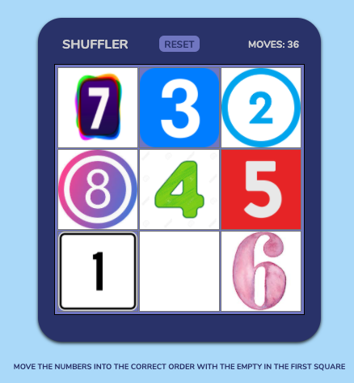

# SHUFFLER
### A scrambled picture, broken up into "pixels", is loaded on the main screen with one 'pixel' missing. The goal in this one person puzzle game is to unscramble the image.

---
## Motivation
#### I love puzzles, and always liked these type of games when I was a kid, so I wanted to recreate one in a digital format.

---
## User Stories & Wireframes

#### One move at a time, user works to unscramble the image by moving cells into the open cell. Number of moves is tracked and logged on screen.


#### * Game proposal mockups:

####   

#### * Game screenshot:

####  


---

## Technologies & Code Snippets
#### * Figma (for initial wireframing), HTML, CSS, JavaScript
#### * Sample code:
#### 
```    
// swaps image, value, and id from clicked cell to empty cell:
    function swapImg() {
        clickedImgCell.setAttribute('src', './images/image0.png')
        clickedImgCell.setAttribute('value', 0)
        clickedImgCell.setAttribute('id', 'img0')
        emptyCell.setAttribute('src', clickedImgSrc)
        emptyCell.setAttribute('value', clickedImgCellVal)
        emptyCell.setAttribute('id', `img${clickedImgCellVal}`)
        const tmp = cellArr[emptyLoc]
        cellArr[emptyLoc]=cellArr[clickedCellLoc]
        cellArr[clickedCellLoc]=tmp
        // console.log(cellArr)
        findEmpty()
        moves+=1
        // console.log(`Moves: ${moves}`)
        document.querySelector('.moves').innerHTML=`MOVES: ${moves}` 
    }
```

---

### Game can be seen **[here.](https://noahbrezel.com/shuffler/)**

---
## Credits
#### My General Assembly instructors, TAs, and class mates were very helpful, as well as numerous MDN and W3Schools articles for understanding JavaScript methods and DOM elements. 

---

## Future development
#### Additions to come will be a larger grid, an image broken up into pixels instead of number images, possibly the ability to load new images from a random image generator on the web.
